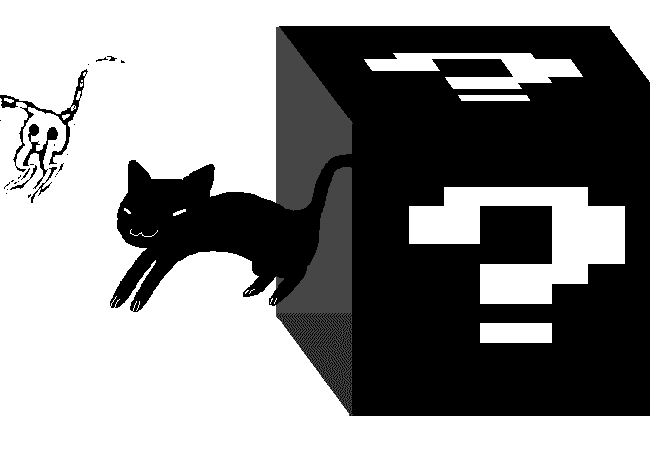
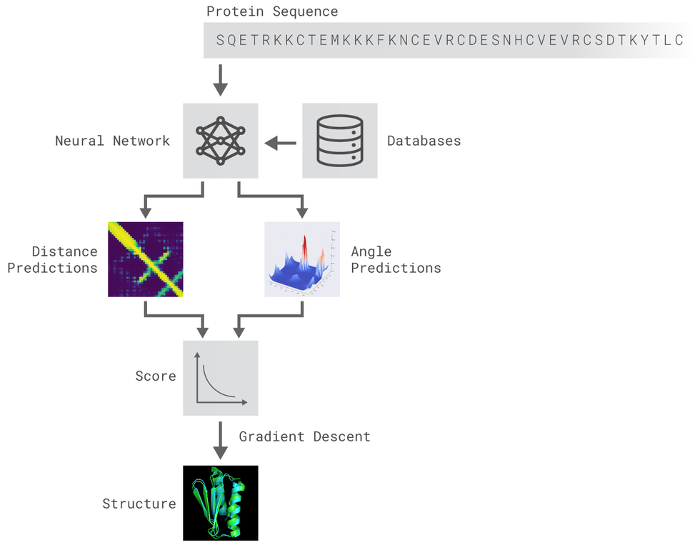

# Quantum Chemistry Dev Kit

*All? the tools necessary to be the master of your protein domain. Docker + a list of frameworks, libraries, software and resources.*

[What's In The Box?](https://www.theringer.com/movies/2020/9/22/21449898/seven-whats-in-the-box)
 
 
 
 

 -  [Quantum Chemistry Tools](#quantum-chemistry-tools)
 -  [Molecular Docking Tools](#molecular-docking-tools) 
 -  [Data Sources](#data-sources)
 -  [Protein Folding](#deep-learning-protein-folding)
 -  [StartUps](#startups)
 -  [Useful References](#useful-references) 
 -  [Quantum Chemistry for New Bournes](#quantum-chemistr-for-new-bournes) 

## Quantum Chemistry Tools 

[NWChem](https://www.nwchem-sw.org/)

### [DeepQMC/PauliNet](https://deepqmc.github.io/index.html) 

*Deep-learning quantum Monte Carlo for electrons in real space*

  * [ :bookmark_tabs: Publication](https://arxiv.org/pdf/1909.08423.pdf): (2020) Deep-neural-network solution of the electronic Schrödinger equation
  * [:floppy_disk: Github](https://github.com/deepqmc/deepqmc)

### [FermiNet](https://deepmind.com/blog/article/FermiNet)

*Implementation of the Fermionic Neural Network for ab-initio electronic structure calculations*

  * [:bookmark_tabs: Publication](https://arxiv.org/abs/1909.02487): (2020) Ab-Initio Solution of the Many-Electron Schrödinger Equation with Deep Neural Networks

  * [:floppy_disk: GitHub Code](https://github.com/deepmind/ferminet)

### [Hande](http://www.hande.org.uk/ent)

*Highly parallel code for stochastic quantum chemistry. Can be used as standalone program or library from an existing quantum chemistry code.*

  * [:bookmark_tabs:  Publication](https://pubs.acs.org/doi/10.1021/acs.jctc.8b01217)
  * [:floppy_disk: : GitHub](https://github.com/hande-qmc/hande)

### [PySCF](http://pyscf.org/) 

*Simple, lightweight, and efficient python platform for quantum chemistry calculations and methodology development.*

  * [:bookmark_tabs: Publication](https://authors.library.caltech.edu/74078/1/1701.08223.pdf)
  * [:bookmark_tabs: Documentation](http://pyscf.org/pyscf/overview.html)
  * [:floppy_disk: Github](https://github.com/pyscf/pyscf)
  * [:floppy_disk: mpi4pyscf](https://github.com/pyscf/mpi4pyscf) - Message Passing Interface parallelism

### [PSi4](https://psicode.org/) 

*Suite of ab initio quantum chemistry programs designed for efficient, high-accuracy simulations of molecular properties*

  * [:bookmark_tabs: Documentation](https://psicode.org/psi4manual/master/index.html)
  * [:floppy_disk: Github](https://github.com/psi4/psi4/)

### [QMCTorch](https://qmctorch.readthedocs.io/en/latest/) 

*Pytorch Implementation of Real Space Quantum Monte Carlo Simulations of Molecular Systems*
  * [:floppy_disk: Github](https://github.com/NLESC-JCER/QMCTorch)

## Molecular Docking Tools

*Tools for exploring how two or more molecular structures fit together*

[AutoDock](http://autodock.scripps.edu/) - suite of automated docking tools designed to predict how small molecules bind to a receptor of known 3D structure

[AutoDock Vina](http://vina.scripps.edu/) - significantly improves the average accuracy of the binding mode predictions compared to AutoDock

* [ :book: Paper](https://www.ncbi.nlm.nih.gov/pmc/articles/PMC3041641/)

[Gnina](https://github.com/gnina/gnina) - deep learning framework for molecular docking -inside deepchem (/dock/pose_generation.py)

[GOMoDo](https://gomodo.grs.kfa-juelich.de/php/about.php) - GPCR online modeling and docking server

[Smina](https://github.com/mwojcikowski/smina) used for minimization (local_only) as opposed to of docking, makes Vina much easer to use and 10-20x faster. Docking performance is about the same since partial charge calculation and file i/o isn't such a big part of the performance.

## Data Sources

[CATH/Gene3D](https://www.cathdb.info/) - 151 Million Protein Domains Classified into 5,481 Superfamilies

[NCBI Conserved Domains Database](https://www.ncbi.nlm.nih.gov/Structure/cdd/wrpsb.cgi) - resource for the annotation of functional units in proteins

[Protein Data Bank](https://www.rcsb.org/)

[Scop 2](https://scop.mrc-lmb.cam.ac.uk/) - Structural Classification of Proteins

[UniProt](https://www.uniprot.org/) -  comprehensive, high-quality and freely accessible resource of protein sequence and functional information.

[XFam](http://xfam.org/]
* [Pfam](http://pfam.xfam.org/) - a large collection of protein families, each represented by multiple sequence alignments and hidden Markov models

## Protein Folding

> There is now a testable explanation for how a protein can fold so quickly: A protein solves its large global optimization problem as a series of smaller local optimization problems, growing and assembling the native structure from peptide fragments, local structures first. [- The Protein Folding Problem](https://www.ncbi.nlm.nih.gov/pmc/articles/PMC2443096/)

 > Structure-function relationships are the fundamental object of knowledge in protein chemistry; they allow us to rationally design drugs, engineer proteins with new functions, and understand why mutations cause disease. [- On The Origin of Proteins](https://www.chemistryworld.com/features/on-the-origin-of-proteins/3004719.article)

The protein folding problem consists of three closely related puzzles:
* (a) What is the folding code? 
* (b) What is the folding mechanism?
* (c) Can we predict the native structure of a protein from its amino acid sequence? [source](https://www.ncbi.nlm.nih.gov/pmc/articles/PMC2443096/)

### [AlphaFold 14](https://www.predictioncenter.org/casp14/doc/presentations/2020_12_01_TS_predictor_AlphaFold2.pdf)

  * [:book: Paper](https://www.nature.com/articles/s41586-019-1923-7.epdf?author_access_token=Z_KaZKDqtKzbE7Wd5HtwI9RgN0jAjWel9jnR3ZoTv0MCcgAwHMgRx9mvLjNQdB2TlQQaa7l420UCtGo8vYQ39gg8lFWR9mAZtvsN_1PrccXfIbc6e-tGSgazNL_XdtQzn1PHfy21qdcxV7Pw-k3htw%3D%3D)
  * [:newspaper: article](https://deepmind.com/blog/article/AlphaFold-Using-AI-for-scientific-discovery)
  * [AlpahFold 14 Results Discussion](https://dasher.wustl.edu/bio5357/discussion/oxford-alphafold2.pdf)
  * [What AlphaFold means for Structural BioInformatics](https://ammiellewb.medium.com/what-alphafold-means-for-structural-bioinformatics-78117adb7d11)
  * [AlphaFold 2 Explained](https://youtu.be/B9PL__gVxLI) - Yanick Video
  * [Illustrated Transformer](kjalammar.github.io/illustrated-transformer/)
  * [Transformers from Scratch](http://peterbloem.nl/blog/transformers)

### [AlphaFold 13](https://www.predictioncenter.org/CASP13/doc/presentations/Pred_CASP13-Structure-AlphaFold-Jumper.pdf)

  * [:floppy_disk: Code](https://github.com/deepmind/deepmind-research/tree/master/alphafold_casp13)
  * [:floppy_disk: Code](https://github.com/dellacortelab/prospr) - Prospr - Open Source Implementation
  * [:book: Prospr Paper](https://www.biorxiv.org/content/10.1101/830273v1) 
  * [AlphaFold @ Casp13: What Just Happened?](https://moalquraishi.wordpress.com/2018/12/09/alphafold-casp13-what-just-happened/) 

### [MiniFold](https://github.com/hypnopump/MiniFold) - Open Source toy example of AlphaFold 13 algorithm 

> The DeepMind work presented @ CASP was not a technological breakthrough (they did not invent any new type of AI) but an engineering one: they applied well-known AI algorithms to a problem along with lots of data and computing power and found a great solution through model design, feature engineering, model ensembling and so on...

> Based on the premise exposed before, the aim of this project is to build a model suitable for protein 3D structure prediction inspired by AlphaFold and many other AI solutions that may appear and achieve SOTA results.

> Two different residual neural networks (ResNets) are used to predict angles between adjacent aminoacids (AAs) and distance between every pair of AAs of a protein. For distance prediction a 2D Resnet was used while for angles prediction a 1D Resnet was used.

[Fold@Home](https://foldingathome.org/about/)

### PDNet

> As deep learning algorithms drive the progress in protein structure prediction, a lot remains to be studied at this merging superhighway of deep learning and protein structure prediction. Recent findings show that inter-residue distance prediction, a more granular version of the well-known contact prediction problem, is a key to predicting accurate models. However, deep learning methods that predict these distances are still in the early stages of their development. To advance these methods and develop other novel methods, a need exists for a small and representative dataset packaged for faster development and testing. In this work, we introduce protein distance net (PDNET), a framework that consists of one such representative dataset along with the scripts for training and testing deep learning methods. The framework also includes all the scripts that were used to curate the dataset, and generate the input features and distance maps.

[:desktop: Github](https://github.com/ba-lab/pdnet/)

[:book: Paper](https://www.nature.com/articles/s41598-020-70181-0) 

[:vhs: YouTube](https://youtu.be/uAIuA1O7iE8)

### Tools 

[Blast](https://blast.ncbi.nlm.nih.gov/Blast.cgi) - Basic Local Alignment Search Tool finds regions of similarity between biological sequences.

### [RaptorX](http://raptorx.uchicago.edu/)

[Raptor Standalone Software](https://github.com/j3xugit/RaptorX-3DModeling)

> RaptorX employs a nonlinear scoring function to combine homologous information (i.e., sequence profile) and structure information in a very flexible way. When proteins under consideration have high-quality sequence profile, RaptorX counts more on profile information, otherwise on structure information to improve alignment accuracy.... Our probabilistic model uses a regression-tree-based nonlinear scoring function to measure the similarity between two proteins. A regression tree consists of a collection of rules to calculate the probability of an alignment. We predict the absolute quality of a pairwise sequence-template alignment using neural network and then use the predicted quality to rank all the templates for a specific target.  Our old RAPTOR program uses an SVM method to predict the number of correctly aligned positions in an alignment

### [trRosetta](https://yanglab.nankai.edu.cn/trRosetta/)

[BigDFT](https://bigdft.org/) - GitLab [Repo](https://gitlab.com/l_sim/bigdft-suite) -DFT code for ab-initio atomistic simulation; "Open source software for innovative research of materials and
macro-molecular systems at the nanoscale"

[CP2K](https://www.cp2k.org/) - Open Source Molecular Dynamics 

## Projects

[Fold@Home](https://foldingathome.org/about/)

## Useful References

(2020) [High-Throughput Docking Using Quantum Mechanical Scoring](https://www.frontiersin.org/articles/10.3389/fchem.2020.00246/full)

(2020) [Deep Learning Methods in Protein Structure Prediction](https://www.sciencedirect.com/science/article/pii/S2001037019304441)

(2019)[From Machine Learning to Deep Learning: Advances in scoring functions for protein-ligand docking](https://onlinelibrary.wiley.com/doi/abs/10.1002/wcms.1429)

(2019) [The Unreasonable Effectiveness of Convolutional Neural Networks in Population Genetic Inference, Molecular Biology and Evolution](https://doi.org/10.1093/molbev/msy224)

(2018) [DeepFam: deep learning based alignment-free method for protein family modeling and prediction](https://doi.org/10.1093/bioinformatics/bty275)

(2018) [Derivative-free neural network for optimizing the scoring functions associated with dynamic programming of pairwise-profile alignment](https://doi.org/10.1186/s13015-018-0123-6)

(2017) [Protein-Ligand Scoring with CNN](https://pubs.acs.org/doi/10.1021/acs.jcim.6b00740)

(2017) [Quantum-chemical insights from deep tensor neural networks](https://www.nature.com/articles/ncomms13890)

(2014) [MRFalign: Protein Homology Detection through Alignment of Markov Random Fields](https://journals.plos.org/ploscompbiol/article?id=10.1371/journal.pcbi.1003500)

(2012) [Molecular Docking: A powerful approach for structure-based drug discovery](https://www.ncbi.nlm.nih.gov/pmc/articles/PMC3151162/#:~:text=The%20docking%20process%20involves%20two,assessment%20of%20the%20binding%20affinity.)

(2011) [The structural basis for agonist and partial agonist action on a β(1)-adrenergic receptor](https://pubmed.ncbi.nlm.nih.gov/21228877/)

(2010) [AutoDock Vina: improving the speed and accuracy of docking with a new scoring function, efficient optimization and multithreading](https://www.ncbi.nlm.nih.gov/pmc/articles/PMC3041641/)

(2009) [Amphipol-Assisted in Vitro Folding of G Protein-Coupled Receptors](https://pubs.acs.org/doi/10.1021/bi801729z)

(2005) [GPCR Folding and Maturation](https://link.springer.com/chapter/10.1007/978-1-59259-919-6_3) from [The G Protein-Coupled Receptors Handbook](https://link.springer.com/book/10.1007/978-1-59259-919-6)

## Other Free Books You Should Read Instead of This Repo

[Chemisty 2E](https://openstax.org/details/books/chemistry-2e) - :atom: Equivalent to 201 & 202 Level Chemistry Book

[Chemistry: Atoms First 2E](https://openstax.org/details/books/chemistry-atoms-first-2e) :atom: Fork of 2E but not with more Atoms!!!!

[Biology 2E](https://openstax.org/details/books/biology-2e) 👽 Like Chemistry 2E but Biology 

[Artificial Intelligence: A Modern Approach]( https://github.com/aimacode/aima-python) 🤖 The Gospel of Machine Learning

[Neural Networks and Deep Learning](http://neuralnetworksanddeeplearning.com/) 🤖 Michael Nielsen writes another masterpiece - About Deep Learning - if you are into that sort of thing. 

[Reinforcement Learning](http://incompleteideas.net/book/RLbook2020.pdf) 🤖  The only book you need on the subject 

[Pattern Recognition and Machine Learning](https://www.microsoft.com/en-us/research/uploads/prod/2006/01/Bishop-Pattern-Recognition-and-Machine-Learning-2006.pdf) 🤖 Another classic banger

## Quantum Chemistry for New Bournes  

> So let it not look strange if I claim that it is much easier to explain the
movement of the giant celestial bodies than to interpret in mechani-
cal terms the origination of just a single caterpillar or a tiny grass. - Immanuel Kant, *Natural History and the Theory of Heaven*, 1755

## Why Quantum Chemistry for New Bournes? 

Books on Cheminformatics, [Bioinformatics](http://thegrantlab.org/teaching/material/Intro_Structural_Bioinformatics_Barry.pdf), Quantum Chemistry strangle the subject to sleep 😴 and command a wild price 🤑 for the naps they induce.

Want a better way to learn than some random repo on github? 

Spend 4-12 years of your life and hundreds of thousands of dollars chasing a paper with a stamp on it 🥇.

Or feed yourself 🍼.

Knoweldge should be cheap, fast enjoyable, silly, shared, disproven, contested, and most of all free.

knowledge hodlers, and innovation stifflers are boring and old. this is for the young of mind and young of spirit 🚼 that love to fold. 

## Let There Be Light

Huygen's Wave Theory || Newtons Particle Theory  

Plank's Quantum Theory = light is made up of discrete energy packets. 

(1905) [On a Heuristic Point of View about the Creation and Conversion of Light](http://users.physik.fu-berlin.de/~kleinert/files/eins_lq.pdf) - Einstein's PhotoElectric Effect

-> Wave Particle Duality

Energy in atoms in quantized.

### Scoring Function 

 There are two common approaches to building a score function: 
* **potentials of mean force**
    * often called statistics- or Boltzmann-based force fields
    * measuring distance as a reflection of statistical tendencies within proteins
    * . One takes a large set of proteins, collects statistics and converts them to a score function. One then expects this function to work well for proteins not included in its parameterisation. 
* **an optimization calculation**
   * select underlying basis function 
      * quasi-Lennard-Jones 
      * various sigmoidal functions 
   * We can say that the correct structure is whatever is given in the protein data bank, but unfortunately, there is almost an infinity of incorrect structures for a sequence and one would like the score function to penalize all of them
  *  One way to encode this idea is to adopt a statistical approach and try to consider the distribution of incorrect structures
 [source](http://web.stanford.edu/class/cs273/refs/torda_chapter_proteomics.pdf)

Allowing gaps and insertions at any position and of any length leads to a combinatorial explosion of possibilities. The calculation can be made tractable by restricting the search space and forbidding gaps except in recognised loops in template structures.

There is a score function and a fast method for producing the best possible sequence to structure alignments and thus the best models possible. Unfortunately, the problem is still not solved

### Probability 
*Coming Soon*

### NMR 
*Coming Soon*
### Multiple Sequence Alignments (MSA) 
*Coming Soon*
###  Kohn–Sham Density Functional Theory (KS-DFT)
*Coming Soon* 
### Hartree–Fock (HF)
*Coming Soon* 
### Coupled Clustering
*Coming Soon*
### B Sheets 
*Coming Soon*
### Amino Acids
*Coming Soon*
### Alpha Helix 
*Coming Soon*

